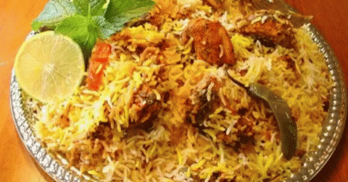

#   Hackademic: Spice-Genie

---------------------------------------------------------------------------------------------------------------------------------------------------
## Spice-Genie Demo :hamburger:

### :rocket::rocket: [Click here to visit Spice Genie](https://xxx32.github.io/Hackademic-Spice-Genie/)

<table>
  <tr>
    <td align="center"></td>
     <td align="center"></td>
       <td align="center"></td>

    
 </tr>
</table>

---------------------------------------------------------------------------------------------------------------------------------------------------
## About our 'Spice Genie'   
Here, we bring you a platform to solve all your cooking hustle. Adamant of making a particular dish? Search it here. Wanna avoid wastage of food? Give us the leftover ingredients, you can make really tasty dishes out of those.:shaved_ice:
 
 
:poultry_leg: Nothing tastes better than the food you want to eat right now. Therefore, this website is mainly intended towards fulfiling your quest to get your desired food :custard::wine_glass: to your table. People usually face problems while they work in the kitchen so as to how they can utilise the residual food while cooking :tropical_drink:. This website helps you to get the recipie :hamburger: of any delicious dish that is possible to be made by using the ingredients that you want. Moreover, it helps to explore various other dishes if you are interested to learn cooking. Best site for food lovers :heart::heart: ; Eat healthy :strawberry::grapes:and be happy to spread happiness around :)

----------------------------------------------------------------------------------------------------------------------------------------------------
## What was our inspiration for 'Spice Genie' ?

We wanted to make a site from which we can learn all about APIs as they are very useful to make user friendly and responsive websites by managing the fetched data properly :tada::tada:.
Secondly, all of us have a speciality related to food, maybe someones hobby is to cook, have a sweet tooth or just the one who likes to munch on something or the other so this website is usable by all such peeps. Also, sometimes we have just basic ingredients at home so inspite of making a regular boring dish, typing ingredients in here may give you a far delicious dish. Sometimes we also have random ingredients :birthday::egg:at home which the new cooks might not know how to use together, so typing in here will give you one which may also prevent wastage of leftover ingredients. So we thought of implementing this thing using API and all the pre knowledge of frontend to make a responsive and a good looking website for all the cooking/food lovers out there. 

----------------------------------------------------------------------------------------------------------------------------------------------------
## What Challenges :bulb: did we run into?

The major challenge that we faced was while setting up our API key and Id. Then we want to hide the key and id which we couldn't do probably because of less time. While displaying the contents from the API we faced another challenge :gem: to align the cards correctly in proper table-order of three columns, but initially it created enough issue. Even displaying carousel also created some problems due to image pixels, but we finaly managed to fix that. Though most of the challenges that we faced could have been done if we had time, and are thus listed in the below section.

----------------------------------------------------------------------------------------------------------------------------------------------------
## If we had more time, what more features would we add to this project ?

This is quite a well developed project now but still if we had time we would like to 
* :star: Learn and implement to hide our API keys and Id.
* :star: Make people register themselves on this site so that they can upload ther own recipies as well.
* :star: And also search recipies, by applying filter (like excluding some ingredients).
* :star: Also to make it a complete food related site, we could have added a section for calorie count and search recipies by calorie count too.

----------------------------------------------------------------------------------------------------------------------------------------------------
## What Accomplishments are we most proud of?

This project really made us feel worthy.:dart: The best part :balloon:of it is that we completed it to the point we decided. The most important thing we accomplished was the use of APIs and their deployment in any of the sites. This site was focussed to make us learn about them.:hamburger::pizza::shaved_ice:

----------------------------------------------------------------------------------------------------------------------------------------------------
## What did we learn?

We knew the basics of frontend developement were the 3 languages HTML, CSS, JAVASCRIPT. Before heading up into backend we wanted to know more about APIs(application programming interface). Thus, we learned how we can drastically increase the useability of any site by simply using such APIs to fulfill our requirements. It improves the productivity of the site and we can use the data fetched from them in different ways according to the need. Therefore we learned :
*  :star:  APIs and their integration in the site.:sparkler:
*  :star:  Usage of CSS, Bootstrap and JavaScript to make site responsive and appealing.
*  :star:  Importance of fonts on a website, and how we can use it. 
*  :star:  Usage and Importance of git & github and enough of git bash commands.:bell:

----------------------------------------------------------------------------------------------------------------------------------------------------
## Tech stack

* HTML
* CSS
* JAVASCRIPT

<table>
  <tr>
     <td align="center"> <b>HTML</b></a> </td>
     <td align="center"> <b>CSS</b></a> </td>
     <td align="center"> <b>JavaScript</b></a> </td>
 
 </tr>
</table>

----------------------------------------------------------------------------------------------------------------------------------------------------

## Team :confetti_ball:

<table>
  <tr>
     <td align="center"><a href="https://github.com/medhabalani"> <b>Medha</b></a> </td>
     <td align="center"><a href="https://github.com/vidushi1012"> <b>Vidushi</b></a> </td>
    <td align="center"><a href="https://github.com/xxx32"> <b>Aarushi</b></a> </td>
     <td align="center"><a href="https://github.com/Jyotika999"> <b>Jyotika</b></a> </td>
 
 </tr>
</table>

----------------------------------------------------------------------------------------------------------------------------------------------------
## Contact Us

This site is a collaboration project of :mortar_board::mortar_board: JYOTIKA, VIDUSHI, MEDHA and AARUSHI, the students of IIIT Allahabad. We would be happy to help you in any way. Please feel free to reach out to us on any of the social media platform or mail for any kind of query. Details of all are given below:-

*  Medha
*  Vidushi
*  Aarushi
*  Jyotika

---------------------------------------------------------------------------------------------------------------------------------------------------
## Thank you for visiting our Repository
Show some :heart: by starring this repository :star:

---------------------------------------------------------------------------------------------------------------------------------------------------
 
